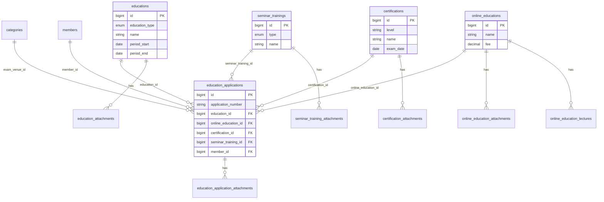

# 교육관리·신청관리 테이블 구조

## 개요

| 구분 | 테이블 | 설명 |
|------|--------|------|
| **교육 안내** | education_contents | 교육 안내 메인 페이지 소개 문구 (1행) |
| **교육관리** | educations | 정기교육·수시교육 |
| | online_educations | 온라인교육 |
| | certifications | 자격증 |
| | seminar_trainings | 세미나·해외연수 |
| **신청관리** | education_applications | 전체 신청 통합 테이블 (4개 FK 중 1개만 사용) |

---

## 1. 교육 안내 (education_contents)

교육 안내 메인 페이지(`/backoffice/education`) 소개 문구용. **1행**만 사용.

| 컬럼 | 타입 | 설명 |
|------|------|------|
| id | bigint | PK |
| education_guide | text | 교육 안내 |
| certification_guide | text | 자격증 안내 |
| expert_level_1 | text | 대학연구행정전문가 1급 |
| expert_level_2 | text | 대학연구행정전문가 2급 |
| seminar_guide | text | 세미나 안내 |
| overseas_training_guide | text | 해외연수 안내 |
| created_at, updated_at | timestamp | |

---

## 2. 교육관리 테이블

### 2-1. educations (정기/수시교육)

| 컬럼 | 타입 | 설명 |
|------|------|------|
| id | bigint | PK |
| education_type | enum | 정기교육 / 수시교육 |
| education_class | string | 교육구분(차수 등) |
| is_public | boolean | 공개/비공개 |
| application_status | string | 접수중/접수마감/접수예정/비공개 |
| name | string | 교육명 |
| period_start, period_end | date | 교육 기간 |
| is_accommodation | boolean | 합숙/비합숙 |
| location | string | 교육 장소 |
| certificate_type | string | 이수증/수료증 |
| fee_member_*, fee_guest_* | decimal | 참가비 |
| education_overview | text | 교육 개요 |
| education_schedule | text | 교육일정 |
| fee_info | text | 참가비 및 납부안내 |
| refund_policy | text | 취소 및 환불규정 |
| curriculum | text | 교과내용 |
| education_notice | text | 교육안내 |
| ... | | (기타: 정원, 신청기간, 입금계좌 등) |

### 2-2. online_educations (온라인교육)

| 컬럼 | 타입 | 설명 |
|------|------|------|
| id | bigint | PK |
| name | string | 교육명 |
| fee | decimal | 참가비 |
| is_free | boolean | 무료 여부 |
| education_overview, education_schedule, fee_info, refund_policy, curriculum, education_notice | text | 에디터 6개 |
| ... | | (기타 공통 필드) |

### 2-3. certifications (자격증)

| 컬럼 | 타입 | 설명 |
|------|------|------|
| id | bigint | PK |
| level | string | 1급/2급 |
| name | string | 자격증명 |
| exam_date | date | 시험일 |
| exam_overview | text | 시험개요 |
| exam_trend | text | 출제경향 |
| exam_venue | text | 시험장 정보 |
| ... | | (기타) |

### 2-4. seminar_trainings (세미나/해외연수)

| 컬럼 | 타입 | 설명 |
|------|------|------|
| id | bigint | PK |
| type | enum | 세미나 / 해외연수 |
| name | string | 프로그램명 |
| education_overview ~ education_notice | text | 에디터 6개 |
| ... | | (기타) |

### 2-5. 교육별 첨부/강의 테이블

| 테이블 | FK | 설명 |
|--------|-----|------|
| education_attachments | education_id | 교육 첨부파일 |
| online_education_lectures | online_education_id | 온라인교육 강의영상 목록 |
| online_education_attachments | online_education_id | 온라인교육 첨부파일 |
| certification_attachments | certification_id | 자격증 첨부파일 |
| seminar_training_attachments | seminar_training_id | 세미나/해외연수 첨부파일 |

---

## 3. 신청관리 테이블

### 3-1. education_applications (통합 신청)

**교육/온라인/자격증/세미나 모든 신청이 하나의 테이블**에 저장됨.  
4개 FK 중 **반드시 1개만** 값 있음.

| 컬럼 | 타입 | 설명 |
|------|------|------|
| id | bigint | PK |
| application_number | string | 신청번호 (자동생성) |
| **education_id** | FK→educations | 정기/수시 신청 시 |
| **online_education_id** | FK→online_educations | 온라인 신청 시 |
| **certification_id** | FK→certifications | 자격증 신청 시 |
| **seminar_training_id** | FK→seminar_trainings | 세미나/해외연수 신청 시 |
| member_id | FK→members | 신청자 |
| applicant_name, affiliation, phone_number, email | | 신청자 정보 |
| application_date | datetime | 신청일시 |
| is_completed | boolean | 이수 여부 |
| course_status | string | 수강상태 (온라인 전용) |
| attendance_rate | decimal | 수강률 (온라인 전용) |
| score, pass_status | | 성적, 합격여부 (자격증 전용) |
| exam_ticket_number, qualification_certificate_number | | 수험표, 자격확인서 (자격증 전용) |
| roommate_* | | 룸메이트 (세미나/해외연수 전용) |
| participation_fee, payment_status, tax_invoice_status | | 결제 관련 공통 |
| ... | | (기타) |

### 3-2. education_application_attachments

| 컬럼 | 타입 | 설명 |
|------|------|------|
| id | bigint | PK |
| education_application_id | FK→education_applications | |
| path, name | string | 파일 |
| type | string | business_registration 등 |
| order | int | 정렬 |

---

## 4. ER 다이어그램

---

## 5. 백오피스 라우트 매핑

| URL | 테이블 | 비고 |
|-----|--------|------|
| /backoffice/education | education_contents | 교육 안내 페이지 |
| /backoffice/education-programs | educations | 정기/수시교육 CRUD |
| /backoffice/online-educations | online_educations | 온라인교육 CRUD |
| /backoffice/certifications | certifications | 자격증 CRUD |
| /backoffice/seminar-trainings | seminar_trainings | 세미나/해외연수 CRUD |
| /backoffice/education-applications | education_applications | education_id 사용 |
| /backoffice/online-education-applications | education_applications | online_education_id 사용 |
| /backoffice/certification-applications | education_applications | certification_id 사용 |
| /backoffice/seminar-training-applications | education_applications | seminar_training_id 사용 |
